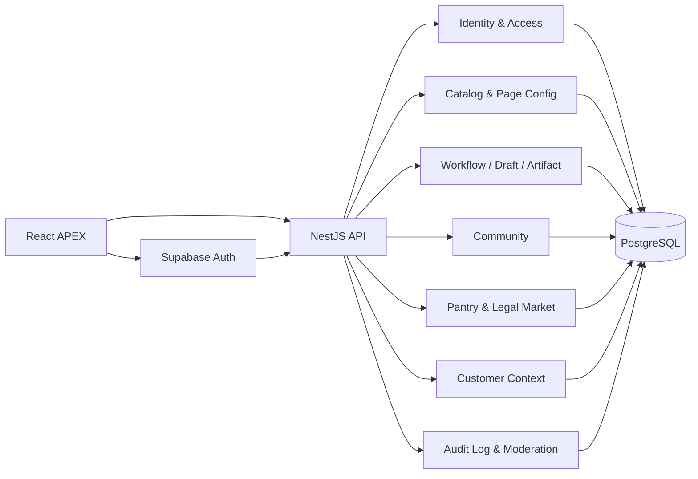

# APEX 全局审计、体验提升与后端建设方案

> 项目：Finish Work Early / APEX
> 审计日期：2026-07-20
> 审计范围：首页、仓库、工作台、我的、社区、地下茶水间、登录注册、宠物系统、26 个 Skill、NestJS 后端、Prisma 数据模型、PostgreSQL 迁移与本地部署
> 原则：保留现有信息架构和成熟 Skill，只补齐真实缺口；“营销端 + 事务端 + 沉淀端”方向不变。

## 一、当前目标

1. 建立一份覆盖产品、UI、交互、前端状态、API、数据库和部署的全局事实底稿。
2. 修复会直接造成空页面、假成功、游客越权、云端数据复活和迁移失败的问题。
3. 把工作台从“帖子列表 + 静态面板”升级为可承接 Skill 工作流的客户经理任务编排中心。
4. 把“我的”从数据展示页升级为用户返回任务、社区、消息和宠物陪伴的个人枢纽。
5. 在不伪装匿名、不鼓励违法交易的前提下，建立“前台匿名、后台可追溯”的地下茶水间和合法闲置置换能力。
6. 明确本地已完成、生产仍需外部配置的边界。

## 二、实现范围与本次产出物

### 2.1 已完成

- 全局源码扫描：295 个项目文件、5,465 个符号、10,059 条关系、300 条执行流。
- 14 个关键页面/状态的移动端与桌面端浏览器审计。
- 26 个仓库 Skill 的入口、用途、成熟度和提升优先级检查。
- 工作台动态、刷新反馈、云端删除、匿名入口和路由滚动修复。
- “我的工作”快捷入口和“我的小东西”内嵌状态卡。
- 敏感沟通助手默认值、合规边界和客户配合清单增强。
- 游客令牌只读化，阻断论坛、茶水间、私信和置换写操作。
- Supabase 登录交换、用户名登录、开发验证码登录涉及的用户字段和会话表迁移补齐。
- PostgreSQL 16 本地服务、12 个迁移、种子数据和完整接口冒烟验证。
- 本文档与独立可视化架构报告。

### 2.2 明确不在本次擅自扩张的范围

- 不重写首页、导航和仓库视觉系统。
- 不改动已经成熟的银承/存单测算、利率优惠签报、宣传稿、材料清单和项下开票工作流核心逻辑。
- 不在没有短信供应商、Supabase 控制台权限和真实收件人的情况下宣称手机 OTP、真实邮件投递已完成。
- 不在没有生产数据库网络权限、域名和托管平台凭据的情况下宣称线上部署已完成。
- 不立即拆分微服务。现阶段模块化单体更符合团队规模、维护成本和渐进接入原则。

## 三、全局结论

APEX 已经不是“只有前端的原型”。仓库内存在一套覆盖认证、用户、论坛、目录、客户上下文、草稿/产物、地下茶水间和审计日志的 NestJS + Prisma 后端。真正的问题不是从零建设，而是三类边界没有收口：

1. **体验边界**：视觉设计已经成熟，但空状态、入口语义和数据反馈会让用户误以为功能不存在。
2. **数据边界**：Dexie 本地数据、论坛 PostgreSQL、Supabase 身份和前端静态目录同时存在，缺少统一的读写优先级。
3. **认证边界**：用户名密码、旧邮箱验证码、Supabase 邮箱/手机 OTP、游客令牌四条路径并存，游客权限此前与注册用户写权限混在一起。

本次优先处理了会造成真实错误或安全误导的部分。较大的服务合并和工作流引擎建设应作为下一阶段，以避免影响成熟 Skill。

## 四、产品与 UI 全局审计

### 4.1 四个一级入口

| 一级入口 | 当前健康度 | 已验证优点 | 主要缺口 | 本次处理 |
|---|---:|---|---|---|
| 首页 | A | 桌面/移动端层级清楚；信息密度、品牌感和 CTA 均稳定 | 未发现阻断性布局问题 | 保持不动 |
| 仓库 | A- | 24 个首屏卡片与场景筛选结构成熟；复杂 Skill 可直接进入 | 平台页面与可执行 Skill 混排；消息中心错误指向 BBS；后端字段映射需保证筛选不退化 | 修复目录映射和生产 API 基址；后续做类型分层 |
| 工作台 | B → A- | 面板已有 7 张高质量导航卡；适合承接工作流 | 后端不可用时动态全空；刷新假成功；云端删除只删本地；普通发帖伪装匿名 | 动态恢复、刷新反馈、云端删除、匿名改由茶水间承接 |
| 我的 | B → A- | 工资/作息/摸鱼叙事有辨识度，视觉完整 | 缺“接着做什么”；宠物只有全局浮层开关；社区和消息入口弱 | 增加 My Hub 与 Pet OS 内嵌状态 |

### 4.2 社区与地下茶水间

| 模块 | 当前状态 | 结论 |
|---|---|---|
| 专业业务区 | PostgreSQL 已接通，帖子/评论/审核能力存在 | 可作为实名或业务身份沉淀区；下一步应合并重复 Forum 调用路径 |
| 地下茶水间 | 已有帖子、临时焚毁、匿名别名、评论、反应、收藏、举报、闲置挂单、订单、会话、消息、通知、WebSocket 和后台治理 | 并非空壳；前台应强调“对其他用户匿名，平台按规则留痕”，不能承诺绝对无痕 |
| 合法置换 | 已支持出售/求购、文字价格或以物换物、订单和私信 | “黑市”只能作为视觉叙事。必须继续禁止账号、银行卡、套现、发票、外挂等交易 |
| 消息中心 | 后端私信能力存在 | 仓库中的 `messages-center` 仍指向 `/bbs`，应在下一阶段统一到真实消息页 |

### 4.3 登录、注册与身份

| 能力 | 当前实现 | 本次状态 | 生产前条件 |
|---|---|---|---|
| 用户名/密码 | NestJS 注册和登录 | 已通过接口实测 | 增加密码找回、限流、登录审计 |
| 邮箱 OTP | 前端 Supabase OTP；后端另有旧验证码流 | Supabase 交换链路可用；开发验证码表已补齐 | 在 Supabase 配置邮件模板；旧验证码流若保留必须配置 SMTP，否则生产拒绝发送 |
| 手机 OTP | 前端 Supabase 手机 OTP | 页面和交换代码存在 | Supabase 启用 Phone Provider、接入短信供应商、配置区域与模板后才能真实验收 |
| 游客 | Demo session JWT | 已改为只读；论坛和茶水间写入实测返回 401 | 可继续保留本地工具体验，不得升级为伪注册用户 |
| 退出 | 前端令牌清理 + Supabase signOut | Profile 与全局布局逻辑已统一 | 若启用服务端会话，再增加撤销/轮换机制 |

## 五、26 个 Skill 分级审计

分级标准：

- **P（Preserve）**：成熟且当前可用，只做回归，不改核心。
- **I（Improve）**：可用但存在明确提升点，可做小步增强。
- **E（Entry）**：本质是平台入口，不应与可执行工具以同一类型展示。

| # | Skill | 路由 | 分级 | 审计结论与建议 |
|---:|---|---|---:|---|
| 1 | 银承/存单测算小助手 | `/acceptance-calculator` | P | 逻辑完整，保留；仅增加回归样例和口径版本号 |
| 2 | 账户业务费用优惠申请 | `/fee-discount` | P | 已形成闭环；保留模板和审批口径 |
| 3 | 利率优惠签报智能生成 | `/rate-offer` | P | 成熟；保留，后续对接版本化政策数据 |
| 4 | 宣传稿排版助手 | `/news-assistant` | P | 成熟；后续只做模板后台化 |
| 5 | 敏感沟通助手 | `/sensitive-comm` | I | 已修默认值和风险表述；下一步接政策版本、分支行差异和法务审核过的话术包 |
| 6 | 项下开票本地下载工具包 | `/batch-billing` | P | 深度工作流完整，保持不动 |
| 7 | 贴现/专门授信工作流 | `/business-guide` | P | 属于核心编排范例，保持不动，并作为 ExperienceCard 数据模型样板 |
| 8 | 长融保 | `/business-guide?product=chang_rong_bao` | P | 已进入产品打法库，保留 |
| 9 | 长易担 | `/business-guide?product=chang_yi_dan` | P | 已进入产品打法库，保留 |
| 10 | 场景中心 | `/scenarios` | E | 平台聚合页，不是单一 Skill；仓库应显示为“场景导航”类型 |
| 11 | 业务通（产品打法库） | `/business-guide` | E | 平台级知识/工作流入口，应与执行工具分层 |
| 12 | 材料清单中心 | `/material-checklist` | P | 已成熟，保持不动；只考虑目录后台化 |
| 13 | 交流社区（BBS） | `/bbs` | E | 社区入口，不应按 Skill 成熟度展示 |
| 14 | 打工风水历 | `/scenarios?tab=self` | I | 与另外两个“对自己”工具共用同一路由，缺独立状态；应在场景中心内有明确锚点/卡片状态 |
| 15 | 今天吃什么 | `/scenarios?tab=self` | I | 同上；建议单独的子路由或 query key |
| 16 | 高效下班清醒系统 | `/scenarios?tab=self` | I | 同上；可与 Pet OS/今日节奏联动，但不改主导航 |
| 17 | 更新日志 | `/updates` | E | 产品运营页，应归类为“平台信息” |
| 18 | 反馈建议 | `/feedback` | E | 运营入口；下一步需真实工单/状态回执 |
| 19 | 制造业行业洞察 | `/business-guide?tab=guide&type=industry` | I | 与科技行业共用泛化路由；需要独立定位参数和内容版本 |
| 20 | 科技企业行业洞察 | `/business-guide?tab=guide&type=industry` | I | 同上 |
| 21 | 首次拜访策略 | `/business-guide?tab=guide&type=scenario` | I | 与竞品策略共用泛化路由；需要场景 ID |
| 22 | 竞争对手挖角策略 | `/business-guide?tab=guide&type=scenario` | I | 同上 |
| 23 | 实战动态（Feed） | `/bbs` | E | 应映射工作台动态或专业社区具体筛选，而不是泛 BBS |
| 24 | 经验发布 | `/bbs` | E | 应直达发帖状态并根据登录态处理 |
| 25 | 消息中心 | `/bbs` | I | 路由错误；后端已有私信，应指向 `/messages` |
| 26 | 个人中心（展业看板） | `/profile` | E | 一级产品入口，不是执行 Skill |

仓库下一阶段的最小改法不是重排视觉，而是给每条目录增加 `entryType`：`TOOL | WORKFLOW | KNOWLEDGE | COMMUNITY | PLATFORM`，保留现有卡片外观，通过标签和筛选区分。

## 六、工作台目标设计：从动态流到项目编排

### 6.1 核心对象 ExperienceCard

把成熟的“超级智能导航帖/工作流”抽象为一张可恢复的任务卡，而不是复制整个页面：

```text
ExperienceCard
├── 目标：这次要完成什么
├── 场景：客户 / 审查 / 中后台 / 自己
├── 当前步骤：第 N 步，共 M 步
├── 输入快照：客户、产品、金额、材料状态
├── 编排节点：调用哪些 Skill
├── 产物：话术、清单、签报、测算、附件
├── 下一动作：继续、补件、复核、分享经验
└── 可见性：仅自己 / 团队经验 / 匿名茶水间
```

### 6.2 工作台三层

1. **现在要做**：最多 3 张进行中 ExperienceCard，显示阻塞点和下一步。
2. **动态**：官方更新、同行经验、自己完成的工作流摘要；数据库不可用时保留明确错误，而非假空状态。
3. **面板**：保留现有 7 张高质量导航卡，再增加“从模板启动”和“最近使用的 Skill 组合”。

### 6.3 第一批可落地编排模板

| 模板 | 编排 Skill | 最终产物 |
|---|---|---|
| 首次客户拜访 | 行业洞察 → 首次拜访策略 → 敏感沟通助手 | 拜访提纲 + 微信开场 + 待确认问题 |
| 授信申报 | 产品打法 → 材料清单 → 授信工作流 → 签报生成 | 缺件表 + 风险点 + 签报草稿 |
| 贴现/开票 | 银承测算 → 贴现工作流 → 项下开票 | 测算结果 + 流程状态 + 下载包 |
| 利率优惠 | 客户上下文 → 利率优惠签报 → 敏感沟通 | 审批稿 + 对客解释 + 跟进节点 |

实现顺序应为：先做可恢复卡片和手工编排模板，再做条件分支，最后才考虑通用工作流编辑器。

## 七、“我的”体验方案

本次已经用最小改动补上两个核心区块：

1. **My Hub / 我的工作**：继续工作、我的消息、专业社区、地下茶水间。
2. **Pet OS / 我的小东西**：直接显示领养/状态，不再只提供一个看不见结果的浮层开关。

下一阶段建议：

- 登录后把“今日战绩”与真实工作流事件关联，而不是只依赖本地计时。
- 宠物只读取低敏状态：连续完成步骤、休息间隔、当天节奏；不读取客户敏感内容。
- 宠物反馈采用短动作和一句话，不增加新的复杂养成经济系统。
- 将草稿、产物、收藏、发帖、置换订单统一成“我的资产”二级页，首页只保留摘要。

## 八、后端现状与目标架构

### 8.1 当前后端模块

- Auth / Supabase bridge / Email auth
- Users / Profiles / Roles
- Forum
- Catalog Products / Skills
- Page Configs
- Customer Context
- Drafts / Artifacts
- Pantry / Market / Messages / Notifications / Moderation / WebSocket
- Audit Log

### 8.2 推荐目标：模块化单体 + 统一身份与内容边界



### 8.3 必须收口的边界

1. **认证唯一主路径**：生产以 Supabase 为身份提供者，NestJS 负责交换、业务用户和授权；用户名密码仅作为受控兼容路径；旧自建邮箱码逐步下线。
2. **论坛唯一服务路径**：Posts/Comments 与 Forum 重复接口统一到 Forum；先做兼容适配，再迁移调用方，最后删除旧路径。
3. **目录唯一事实源**：Products、Skills、Page Config 以 PostgreSQL 为主，前端静态数据只作为版本化离线兜底，并记录 fallback 状态。
4. **本地/云端同步规则**：游客只写本地；注册用户以云端为主，本地作为缓存和离线队列；每条数据必须有来源和同步状态。
5. **匿名边界**：前端只展示 alias，后端持有 userId 和审计事件；管理员访问真实映射必须有角色控制和日志。

## 九、数据库、环境与部署

### 9.1 本地开发

- PostgreSQL 16 通过 Homebrew service 运行。
- 本地开发库：`finish_work_early`，连接信息只放在未提交环境变量中。
- 12 个迁移已从空库完整执行。
- 种子数据：3 用户、10 版块、26 Skills、5 Products、32 帖子。
- 前端：`http://127.0.0.1:5173`
- 后端：`http://127.0.0.1:3000/api/v1`

### 9.2 测试环境

建议独立 PostgreSQL 数据库和独立 Supabase project；CI 顺序：

1. 安装依赖并生成 Prisma Client。
2. 对空库执行 `prisma migrate deploy`。
3. 执行种子或最小 fixture。
4. 跑后端构建、接口集成测试、前端 lint/build。
5. 部署后跑 health、注册/登录、发帖/评论、草稿/产物、茶水间和消息冒烟。

### 9.3 生产环境

推荐同一区域部署前端、NestJS 和 PostgreSQL，生产只通过环境变量提供：

- `DATABASE_URL`
- `JWT_SECRET`
- `SUPABASE_URL`
- Supabase 服务端验证所需 key
- 前端公开 Supabase URL/anon key
- CORS 允许域名
- SMTP（仅当继续保留旧邮箱验证码）

发现历史部署文档中存在不应长期留在版本库的真实数据库凭据痕迹。生产上线前必须轮换相关凭据，并清理 Git 历史；本文不复述任何密钥。

## 十、本次修复清单

| 类别 | 修复 |
|---|---|
| 路由体验 | SPA 页面切换自动滚动到顶部 |
| 内容目录 | 生产 API 改为同源兜底；保留后端 `detailData.sceneTags` 映射 |
| 工作台 | 后端动态可见；刷新区分成功/部分失败/失败；云端草稿与产物调用真实删除 API；普通发帖不再伪匿名 |
| 我的 | 增加工作快捷入口、茶水间入口、Pet OS 内嵌状态；Supabase 退出统一 |
| 社区 | 将错误的“仅本地存储”改为“注册可发 · 后台留痕” |
| 游客安全 | JWT 标记 `authKind`；AuthGuard 阻断 guest/demo 对受保护接口写入 |
| 敏感沟通 | 修复默认日期未进入状态；移除硬编码优惠承诺；增加系统/网点最终确认边界 |
| Pet OS | 修复中英文姿态枚举和 mood tint 映射不一致 |
| 数据迁移 | 增加茶水间身份前置迁移；补用户资料字段、验证码和会话表 |
| 种子 | Prisma PostgreSQL adapter 接入，适配 `engineType=client` |
| 邮箱码 | 使用加密安全随机数；生产无 SMTP 时拒绝伪发送；开发仅控制台预览 |

## 十一、测试方法与实测结果

### 11.1 自动化/确定性检查

| 检查 | 结果 |
|---|---|
| 前端 ESLint | 通过 |
| 前端生产构建 | 通过；存在大包体警告 |
| 后端 NestJS 构建 | 通过 |
| Prisma schema validate | 通过 |
| 空库执行 12 个迁移 | 通过 |
| Prisma migration status | schema up to date |
| 种子数据 | 通过 |
| Health / boards / catalog | 200，10 版块，26 Skills |
| 用户注册/登录 | 201 / 201 |
| 发帖/评论 | 201 / 201 |
| 草稿创建/删除 | 201 / 200 |
| 产物创建/删除 | 201 / 200 |
| 茶水间匿名帖 | 201 |
| “绿萝换咖啡”合法置换 | 201 |
| 会话创建/消息发送 | 201 / 201 |
| 游客论坛写入 | 401，符合只读预期 |
| 游客茶水间写入 | 401，符合只读预期 |
| 无效 Supabase token | 401 |

### 11.2 浏览器验收

- 工作台：空流变为数据库动态，置顶帖和验收帖可见。
- 路由：从长页面滚动 1,200px 后点击首页，`scrollY` 回到 0。
- 我的：My Hub 四入口和 Pet OS 状态卡可访问。
- 游客：页面明确说明不能发帖、评论、私信或置换。
- 敏感沟通：生成结果包含默认日期 `2026年4月1日` 和“以系统查询和网点最终确认为准”。
- 社区：地下茶水间标识为“注册可发 · 后台留痕”。

截图证据位于：

`/Users/daisy/.codex/visualizations/2026/07/20/019f800c-3090-7913-88aa-f6add29aa83b/apex-audit/`

其中重点为 `15-workspace-feed-populated-mobile.jpg`、`16-profile-hub-pet-mobile.jpg`、`17-login-guest-readonly-mobile.jpg`。

## 十二、风险点与优先级

### P0：生产上线前必须解决

1. 轮换并清除历史文档中的数据库凭据。
2. 为登录、发送验证码、发帖、评论、私信和挂单增加速率限制。
3. 确认 Supabase 手机供应商、邮件模板、回调域和生产 key。
4. 配置生产 PostgreSQL 网络白名单/连接池，并在备份后执行迁移。
5. 为 Pantry 管理员揭示身份映射的行为增加不可篡改审计。

### P1：下一建设阶段

1. 合并 Forum 重复 API 路径。
2. 建立 ExperienceCard、WorkflowRun、WorkflowStep、ArtifactLink 数据模型。
3. 统一本地缓存与云端同步状态机。
4. 修复消息中心和 8 个泛化入口路由。
5. 建立后端 Jest/e2e 测试；现有 Python API 测试文档已滞后。

### P2：质量与性能

1. 主包约 2.4 MB，游戏图片还有数 MB；按路由拆包并延迟加载重资源。
2. 将 1,000 行级 Pantry 页面/服务按领域用例拆分，但保持单模块部署。
3. 增加可访问性检查、错误边界和离线状态展示。

## 十三、执行步骤

1. 保留本次修复，先完成一轮真实邮箱和真实手机 OTP 验收。
2. 配置独立测试数据库与 Supabase 测试项目，加入 CI 空库迁移检查。
3. 以“首次客户拜访”作为第一个 ExperienceCard 模板，小范围接入现有 Skill。
4. 将工作台草稿、产物和工作流运行统一到云端，同时保留游客本地体验。
5. 迁移 Forum 重复调用方，观察一版后再删除旧 API。
6. 完成生产凭据轮换、备份、迁移、冒烟与回滚演练后上线。

## 十四、回滚

- 代码：本次未提交，可逐文件审查或回退本次差异；不得覆盖用户原有的 `AGENTS.md`、`CLAUDE.md` 修改。
- 数据库：生产执行迁移前必须创建快照；本次新增迁移均为向前增加对象，不包含数据删除。
- 本地 PostgreSQL：停止服务可执行 `brew services stop postgresql@16`；如确认不再需要，可另行卸载。停止服务不会自动删除本地数据库目录。
